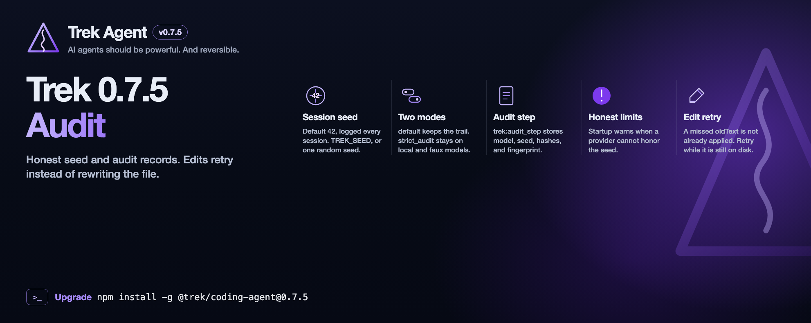

# Trek Agent v0.8.0

Trek is a **hard fork of the [Pi Coding Agent](https://pi.dev/)** — the minimal terminal coding agent with read, bash, edit, write tools, sessions, and a TypeScript extension ecosystem.

Pi optimizes for simplicity and adaptability: you extend it with plugins rather than inheriting a heavy built-in stack. Trek keeps that surface — CLI ergonomics, Pi packages, and extension APIs — and adds a **staged roadmap** toward a production-grade agent with explicit safety, determinism, memory, domain-specific workflows, and local model routing.

**What Trek adds (roadmap-driven):**

| Layer | Goal | Releases |
|---|---|---|
| **Safety** | Laws hierarchy, HALT, read-before-write, honesty protocol, dry-run, sandbox, undo | **0.4.0 Guardrails** → 0.13.0 Guardrails+ |
| **Undo** | `.trek` file versions, `trek history` / `trek revert`, labeled git commits | **0.5.0 Undo** |
| **Determinism** | Full O→I→A→R traces, replay, seed logging, honest reproducibility limits | 0.6.0 Trace → 0.7.5 Audit |
| **Memory** | Session / project / global layers with incremental indexing | 0.11.0 Memory |
| **Domain workflows** | Predefined per-domain workflows in [Archon](https://github.com/coleam00/archon) YAML (`name`, `description`, `nodes`). [ClawHub skills](https://clawhub.ai/dashboard) inspire the domain and workflow list only. Each task context detects the work domain and the Archon workflow it needs (Meta, AI, Security always candidates). `trek workflows run` is an override | 0.12.0 Domains |
| **Local model hierarchy** | API-first by default. Opt-in `local` / `hybrid` llama.cpp roles (Mistral suite). Frontier is the fourth layer. Per-component routing is later | **0.8.0 Runtime** (current) → 0.9.0 Routing |

Every user turn follows **Observe → Intend → Act → Reflect** (O→I→A→R). Safety checks wrap **Act**. During **Intend**, Trek detects the work domain from that task context and selects the workflow the context needs. The next turn detects again. Traces and audit metadata accumulate over time so behavior is inspectable, not opaque.

Pi compatibility is preserved: community packages from [pi.dev/packages](https://pi.dev/packages) install with `trek install npm:<package>`. See [Pi Coding Agent plugins](#pi-coding-agent-plugins) below.

**Version:** 0.8.0 — see [CHANGELOG.md](./CHANGELOG.md). Full plan: [ROADMAP.md](../ROADMAP.md).

## Status

**0.8.0** is current. Default mode is remote API. `local` and `hybrid` opt in to llama.cpp. A local role completes on `llama-server` and does not call the saved API model. **0.7.0 Audit** shipped the session seed (default `42`), `default` / `strict_audit` modes, per-step `trek:audit_step` records, and honest warnings when a provider cannot honor seed. Bit-exact replay is not claimed on closed APIs or on GPU llama.cpp. Next: **0.9.0 Routing**. Artifact files under `.trek/versions/` are local history (keep them out of git; labeled commits are the git undo layer).

## Models

The hierarchy is `api` (default), `local`, or `hybrid`. `trek models` prints the saved mode and the effective mode. `~/.trek/models.yaml` is the registry. A project `.trek/models.yaml` overrides it. Launch `trek` from the project you want the agent to edit. `--provider` and `--model` choose the chat model in `api` mode, and for the Frontier role in `hybrid`. A local role completes on `llama-server` for that GGUF. The saved API model in settings is not called and is not overwritten. Per-component routing remains 0.9.0.

```bash
trek models
trek models set-mode api|local|hybrid
trek models set-suite mistral|mistral-pro|qwen|lfm
trek models set-role workhorse --id <id> --thinking off
trek models benchmark
```

| Suite | Tooling | Work-horse | Planning |
|---|---|---|---|
| `mistral` (default) | Qwen3.5-0.8B | Ministral-3-3B-Instruct-2512 | Ministral-3-8B-Reasoning-2512 |
| `mistral-pro` | Qwen3.5-0.8B | Devstral-Small-2507 | Ministral-3-8B-Reasoning-2512 |
| `qwen` | Qwen3.5-0.8B | Qwen3.5-4B | Qwen3.5-9B |
| `lfm` | LFM2.5-350M | LFM2.5-1.2B-Instruct | LFM2.5-8B-A1B |

A normal prompt selects Work-horse. A prompt that says plan, planning, or research selects Planning. `/frontier`, or a step above the complexity threshold, selects Frontier in `hybrid` and Planning in pure `local`. Embedding and reranker rows are registered for 0.11.0 and are not started.

### Pure API

No `llama-server` process, and no Hugging Face token.

```bash
trek models set-mode api
cd /path/to/your/project
trek --provider xai --model grok-4.20-0309-reasoning
```

Omit `--provider` and `--model` to keep the saved session model. The suite name is stored and unused while the effective mode is `api`.

### Pure local

`local` stays local only when the process has none of `XAI_API_KEY`, `OPENAI_API_KEY`, `ANTHROPIC_API_KEY`, `GEMINI_API_KEY`, or `GOOGLE_API_KEY`. The first of those that is set promotes `local` to `hybrid`. A key saved in `~/.trek/agent/auth.json` does not promote. Do not source `.env` in this shell if that file contains a Frontier key.

```bash
trek models set-mode local
trek models set-suite lfm
trek models
```

`effective: local` is the check. A normal reply then comes from the Work-horse GGUF. Grok and the other Frontier APIs are not called. The local suite is told to build in the current folder with the tools, not to paste a tutorial. A request to build, run, or open something requires a tool call until a file has been written and a command has been run. Each local completion stops after 120 seconds or 4,096 tokens. A Planning prompt uses the Planning GGUF and fails if that file is absent, instead of falling back to the API. Then install a llama.cpp build that can load the suite and the Q4_K_M weights that fit the budget:

```bash
./scripts/bootstrap-llama.sh lfm
set -a && source ~/.trek/llama-live.env && set +a
unset XAI_API_KEY OPENAI_API_KEY ANTHROPIC_API_KEY GEMINI_API_KEY GOOGLE_API_KEY PI_NO_LOCAL_LLM
cd /path/to/your/project
trek
```

`~/.trek/llama-live.env` sets `TREK_LLAMA_SERVER`, `TREK_MODELS_DIR`, and `TREK_LLAMA_CTX`. It contains no secrets. `llama-server` logs append to `~/.trek/logs/llama-server.log` (`TREK_LLAMA_LOG` overrides that path) and are not written on the prompt line. When the session ends, including `trek --print`, those servers are stopped so the process can exit. `HF_TOKEN` belongs in `.env` (see `.env.example`) and is used only by the bootstrap download. The default weight budget is 4 GiB (`TREK_LLAMA_MAX_BYTES`). Planning weights above that budget are not downloaded, so a Planning prompt will not start `llama-server` until that file is present. Pass one or more suite names to `bootstrap-llama.sh` (`mistral`, `mistral-pro`, `qwen`, `lfm`). With no arguments it prepares all four.

### Hybrid

Frontier is a fourth layer for `/frontier` and for heavier steps, and that layer uses the session API model. Local Tooling, Work-horse, and Planning complete on llama.cpp when their weights exist.

```bash
trek models set-mode hybrid
trek models set-suite mistral
export XAI_API_KEY='your-key'
set -a && source ~/.trek/llama-live.env && set +a
cd /path/to/your/project
trek --provider xai
```

`set-mode local` with one of the Frontier keys above already in the environment is the same effective mode. Frontier detection order is `XAI_API_KEY`, `OPENAI_API_KEY`, `ANTHROPIC_API_KEY`, then `GEMINI_API_KEY` or `GOOGLE_API_KEY`. `trek models` should print `effective: hybrid`.

Product weight download in the CLI is 0.16.0. Optional probes are `./scripts/bootstrap-llama.sh` and `./scripts/test-llama-live.sh`. `./test.sh` clears API keys and sets `PI_NO_LOCAL_LLM=1`, so it does not start llama.cpp.

## Trace CLI

Inspect the latest session JSONL (or pass `--session` / `--session-dir`):

```bash
trek trace list
trek trace show c-0001
trek trace diff c-0001
trek trace fork c-0001
trek trace replay c-0001 --observe "patched observation"
```

`--diagnostic` / `TREK_DIAGNOSTIC=1` records traces and blocks mutating tools (write/edit/bash).

## Reproducibility

Honest best-effort: the session seed is always logged. Closed APIs may still drift.

```bash
trek config reproducibility
trek config reproducibility --mode default|strict_audit
trek config reproducibility --seed 42
trek config reproducibility --seed random
```

- **default:** log seed, temperature, and `trek:audit_step` hashes; send seed when the provider accepts it.
- **strict_audit:** refuse a provider or local model that cannot honor seed. `faux` passes. A dense local GGUF passes only with `TREK_LLAMA_NGL=0` (CPU). The default GPU path does not.
- **`TREK_SEED`:** integer or `random`. **`TREK_REPRODUCIBILITY_MODE`:** `default` or `strict_audit`. **`TREK_LLAMA_NGL=0`:** pass `-ngl 0` so llama-server stays on CPU.
- Startup warns when the active provider or local model cannot honor determinism (suppressed by `quietStartup`; still written to the debug log). `trek config reproducibility` prints the provider table and the local model table.

Dense chat models (`Qwen3.5-0.8B`, `Ministral-3-3B-Instruct-2512`, `Ministral-3-8B-Reasoning-2512`, `Devstral-Small-2507`, `Qwen3.5-4B`, `Qwen3.5-9B`, `LFM2.5-350M`, `LFM2.5-1.2B-Instruct`) are best-effort on the GPU and seed-honored on CPU at temperature 0. `LFM2.5-8B-A1B` is a mixture of experts and stays best-effort on CPU as well. Embedding and reranker ids are encoders, not chat models, and are not eligible for `strict_audit`.

## Telegram

Long-poll Bot API and drive the same `AgentSession` as the TUI (a channel, not a second agent).

```bash
trek telegram
```

Config (`~/.trek/telegram.json`):

```json
{
  "token": "<bot-token>",
  "allowed_user_ids": [123456789],
  "allowed_chat_ids": [-1001234567890],
  "bot_username": "trekbot"
}
```

Token may also come from `TREK_TELEGRAM_BOT_TOKEN`. Startup refuses an empty allowlist.

- **DMs:** one isolated session per chat (`/start` `/help` `/new` `/status` `/stop` `/confirm`).
- **Groups:** reply only on `/command` or `@bot` mention; per-chat (and forum topic) session. Unlisted senders never run tools.
- **Safety:** `/stop` HALTs at the next tool boundary; gated/destructive ops need `/confirm` in that session. Full traces are omitted in groups (use a DM or `trek trace show`).
- **Media:** photos/documents stage under `cwd/.trek/telegram/inbox/` and attach as image/file context. Stickers and voice get a short unsupported ack. Long replies split or send as a file.

## Quick start

```bash
cd trek
npm install
npm run build
npx trek --help
```

Config and sessions live under `~/.trek/agent/` by default.

## Pi Coding Agent plugins

Trek keeps Pi’s extension ecosystem. Existing Pi plugins and packages work without rewrites.

- **npm/git packages** — install with Trek’s package manager (not plain `npm install`):

  ```bash
  trek install npm:pi-agent-extensions
  trek list
  trek remove npm:pi-agent-extensions
  ```

- **Single-file extensions** — `trek -e ./my-extension.ts` or drop files in `~/.trek/agent/extensions/`.
- **Pi manifests** — `package.json` `"pi": { "extensions": [...] }` is honored (same as `"trek"`).
- **Pi imports** — `@earendil-works/pi-*` and `@mariozechner/pi-*` resolve to Trek packages via virtual module aliases.

See [UPSTREAM.md](./UPSTREAM.md) and [packages/coding-agent/docs/packages.md](./packages/coding-agent/docs/packages.md) for details.

## Upstream

See [UPSTREAM.md](./UPSTREAM.md) for the pinned Pi commit and rename map.

## License

MIT — see [LICENSE](./LICENSE).
